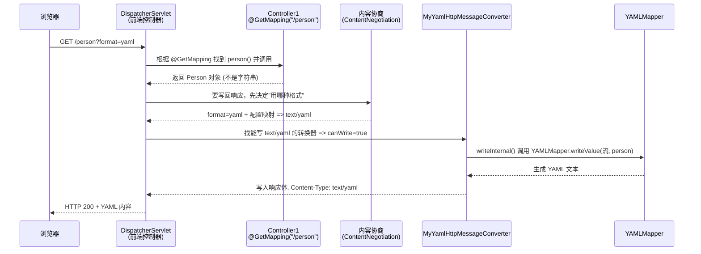

### 一、整体流程（请求 `/person?format=yaml` 时）

一次请求从浏览器到返回 YAML，会经历下面这条链：



### 二、每个文件的作用和原理

1. `E:\springboot\deom\src\main\java\cn\maver\deom\compoment\MyYamlHttpMessageConverter.java` —— 核心组件

这是 **自定义的 HTTP 消息转换器**。Spring MVC 里，任何"Java 对象 ⇄ 响应/请求体字节"的转换都靠 `HttpMessageConverter`
接口完成，JSON 的转换器、String 的转换器都是它的实现。

它继承 `AbstractHttpMessageConverter<Object>`，这个抽象类帮你做掉了"通用工作"，只留三个抽象方法给你实现：

| 方法                 | 作用                                             | 这里的实现                      |
|----------------------|--------------------------------------------------|---------------------------------|
| `supports(Class)`    | **准入开关**：这个转换器能不能处理某个类型的对象 | 返回 `true`，表示什么类型都能转 |
| `readInternal(...)`  | **入站**：把请求体读成对象（反序列化）           | 返回 `null`，暂时不处理读       |
| `writeInternal(...)` | **出站**：把对象写成响应体（序列化）             | 用 `YAMLMapper` 写 YAML         |

关键点：

- **构造器**里的 `super(new MediaType("text", "yaml", Charset.forName("UTF-8")))` 声明了这个转换器支持的媒体类型是
  `text/yaml`。Spring 做 `canWrite` 判断时就是拿它和"客户端想要的类型"做匹配。
- **`YAMLMapper`** 是 Jackson 3（`tools.jackson`）里 YAML 专用的 `ObjectMapper`，它本身就是
  `tools.jackson.databind.ObjectMapper` 的子类，所以 `private ObjectMapper objectMapper` 字段直接赋 `new YAMLMapper()`
  即可。`writeValue(输出流, 对象)` 一行就把对象序列化成 YAML 写进响应流。
- `try (OutputStream os = outputMessage.getBody())` 是 try-with-resources：自动关闭输出流。

2. `E:\springboot\deom\src\main\java\cn\maver\deom\config\MyConfig.java` —— 把转换器注册进 MVC

Spring MVC 的转换器列表由 `WebMvcConfigurer` 来定制。这里用一个 `@Bean` 返回匿名内部类：

```java
builder.configureMessageConvertersList(converters ->
        converters.

add(new MyYamlHttpMessageConverter())
        );
```

原理（这是之前踩坑的重点）：

- Spring 7 / Boot 4 里，旧的 `configureMessageConverters(List)` 方法 **已废弃**。往那个列表里 `add`
  任意一个转换器，框架就认为"你要完全接管转换器列表"，于是 **JSON、String 等默认转换器全部不再注册**（之前
  `Accept: application/json` 报 406 就是这个原因）。
- 新 API 是 `configureMessageConverters(HttpMessageConverters.ServerBuilder)`。`ServerBuilder` 是一个"建造器"：先由框架用
  `registerDefaults()` 探测 classpath，自动注册好 JSON、String、YAML 等默认转换器，最后统一组装成列表。
- `configureMessageConvertersList(...)` 是在 **默认转换器全部组装完之后**再对最终列表做追加，所以你的 YAML 转换器排在
  JSON **后面**——这就是为什么默认请求仍是 JSON，只有明确要 YAML 时才走你的转换器。

### 三、为什么"默认请求返回 JSON，加参数才返回 YAML"

- 不加参数时：没有 `format` 参数，协商落到 `Accept: */*`，Spring 从转换器列表里挑"最合适"的——JSON 转换器排在前面，于是返回
  `application/json`。
- 加 `?format=yaml` 时：协商结果明确是 `text/yaml`，JSON 转换器不支持 `text/yaml`（`application/json` 与 `text/yaml`
  不兼容），只有你的 `MyYamlHttpMessageConverter` 支持，于是选中它返回 YAML。
- 加 `?format=json` 时：`json` 是 Spring 内置认识的扩展名，映射成 `application/json`，走默认 JSON 转换器。

### 四、一句话总结

> `application.properties` 告诉 Spring"允许用 `?format=` 参数来协商格式，并且 `yaml` 对应 `text/yaml`"；`MyConfig` 用
> Spring 7 的新 API 把你的自定义转换器 **追加**到默认转换器之后；请求进来后 Spring 先做内容协商确定 `text/yaml`，再按顺序找到
> `MyYamlHttpMessageConverter`，由它内部用 Jackson 3 的 `YAMLMapper` 把 `Person` 对象序列化成 YAML 写回响应。

需要我针对其中某一步（比如内容协商的源码路径、`ServerBuilder` 组装顺序）再展开讲讲吗？
