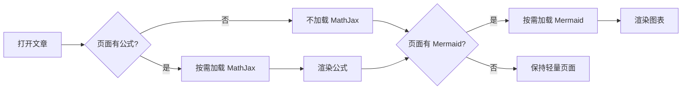
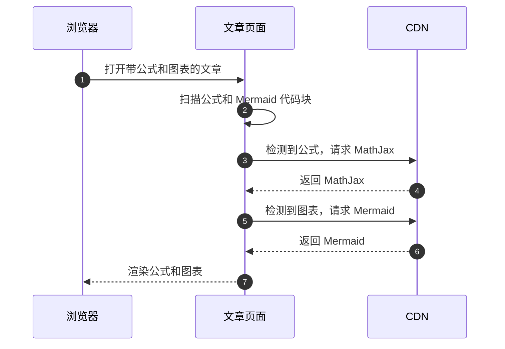
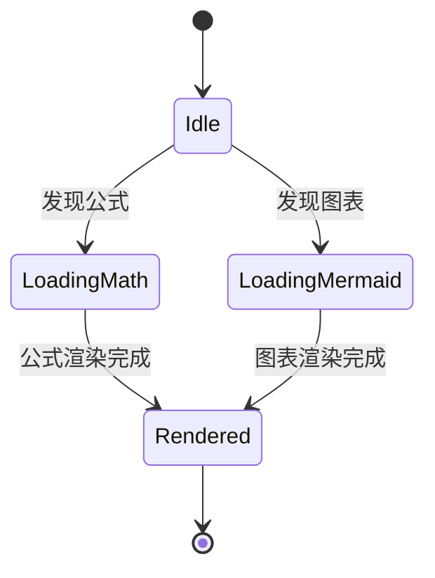

### 数学公式渲染

这是一段行内公式测试：若物体质量为 $m$、光速为 $c$，则质能关系为 $E = mc^2$。

下面测试上下标、分数、根式、求和、希腊字母和分段函数：

$$
\bar{x} = \frac{1}{n}\sum_{i=1}^{n} x_i
$$

$$
f(x) =
\begin{cases}
x^2 + \sqrt{2x}, & x \ge 0 \\
-x^3 - \alpha, & x < 0
\end{cases}
$$

再测试一个概率统计中的高斯分布：

$$
f(x \mid \mu, \sigma^2) =
\frac{1}{\sigma\sqrt{2\pi}}
e^{-\frac{(x-\mu)^2}{2\sigma^2}},
\quad \sigma > 0
$$

### Mermaid 流程图

### Mermaid 时序图

### Mermaid 状态图

### 检查点

1. 公式应显示为排版后的数学符号，而不是原始的 LaTeX 文本。
2. 三个 Mermaid 代码块都应渲染成图形，而不是保持代码块状态。
3. 打开浏览器开发者工具的 Network 面板后，应能看到这两个请求：
   `https://cdn.jsdelivr.net/npm/mathjax@3.2.2/es5/tex-svg-full.js`
   和 `https://cdn.jsdelivr.net/npm/mermaid@11.16.1/dist/mermaid.min.js`。
4. 第二次刷新页面时，这两个资源应显示来自磁盘缓存或内存缓存。
